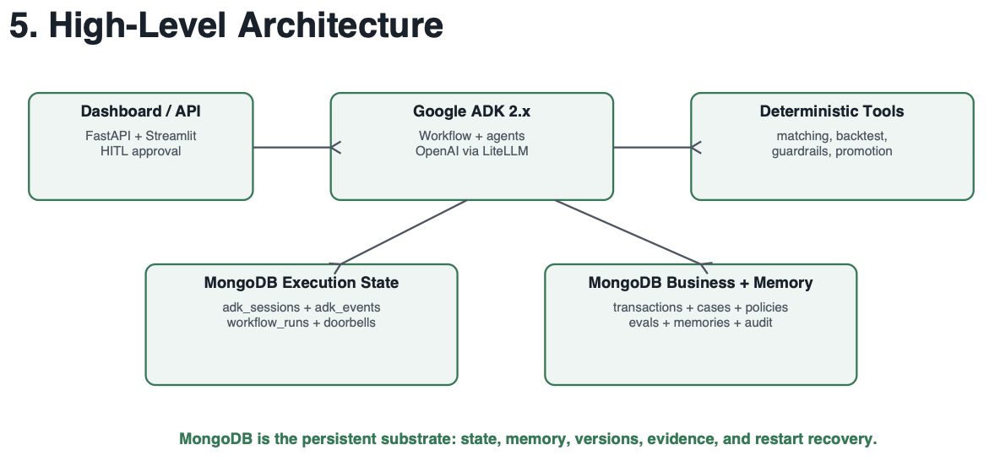
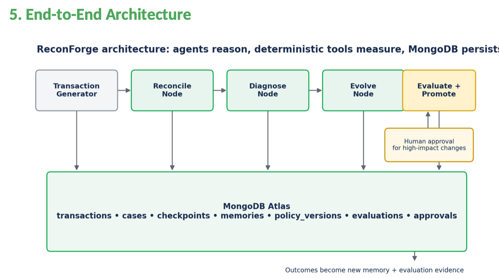
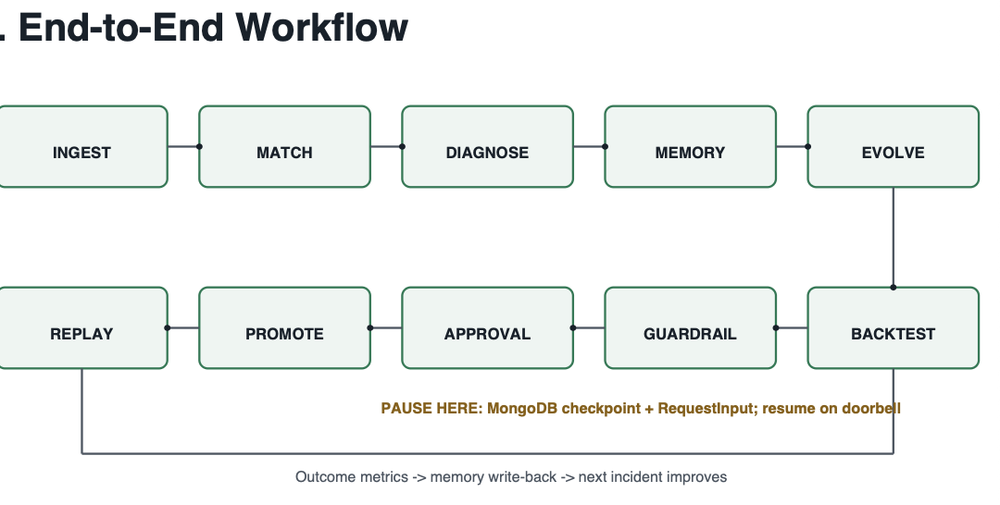
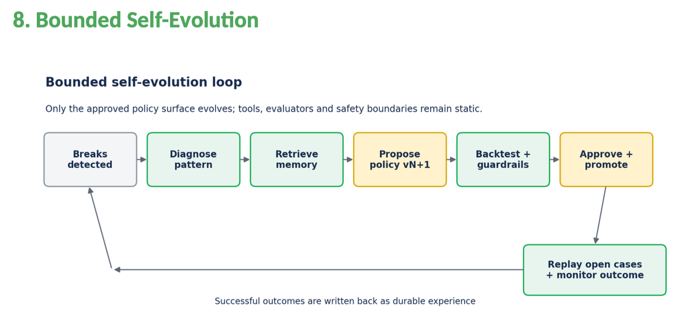

# ReconForge

ReconForge is a persistent reconciliation demo. Deterministic matching and evaluation identify recurring breaks; bounded agents can propose policy changes; fixed guardrails and a human decision control promotion.

Checkout our demo here!
https://drive.google.com/file/d/1qeRYCI3H9UTcMZwWcujwjt64Nk5U12nX/view?usp=drive_link

## High-Level Architecture



The diagram gives a high-level view of the API, workflow, deterministic tools, and MongoDB persistence. The frontend has since migrated from Streamlit to React: Vite serves it during development, and FastAPI can serve the production build.

## End-to-End Architecture



Transactions move through deterministic reconciliation, agent diagnosis and evolution, independent evaluation, and human approval. MongoDB stores business data, policy versions, checkpoints, evaluations, and approvals.

## End-to-End Workflow



The workflow can pause at human approval and resume from its persisted checkpoint when a decision arrives. After promotion, the candidate is replayed against open cases and monitored.

## Bounded Self-Evolution



Agents can propose changes only within the approved policy surface. Deterministic backtesting and fixed guardrails evaluate each candidate, and a human must approve it before promotion.

## Requirements

- Python 3.11 or newer
- [`uv`](https://docs.astral.sh/uv/)
- Node.js 20 or newer with npm
- MongoDB Atlas or another MongoDB deployment
- `GEMINI_API_KEY` for workflows that call the diagnosis and evolution agents

Dataset files are included in `ReconForge_Reconciliation_Dataset/`.

## Configure

From the repository root, create your local environment file:

```bash
cp .env.example .env
```

Set `MONGODB_URI` and `MONGODB_DB` in `.env`. Set `GEMINI_API_KEY` to enable agent-powered upgrade workflows. Keep `.env` private; do not commit credentials.

## Run locally

Install the Python dependencies:

```bash
uv sync
```

In one terminal, start the API:

```bash
uv run uvicorn app.api:app --reload
```

In a second terminal, start the React development server:

```bash
cd frontend
npm install
npm run dev
```

Open the local URL printed by Vite, usually http://127.0.0.1:5173. The Vite server proxies API requests to `http://127.0.0.1:8000`. On API startup, ReconForge loads the demo dataset and baseline policy into the configured database.

## Seed or repair demo data

If the dashboard says seed data is missing, first check the API terminal for MongoDB connection or dataset path errors. Then, from the repository root, run:

```bash
uv run python scripts/seed_demo.py
```

The script is safe to rerun: it inserts missing demo records and the baseline policy without clearing existing data. The Overview page also displays a **Seed demo data** button when the baseline policy is missing.

## Build and serve the UI

Build the React app:

```bash
cd frontend
npm install
npm run build
```

Then start the API from the repository root and open http://127.0.0.1:8000. FastAPI serves the built frontend from `frontend/dist` when that directory exists.

## Dashboard sections

- **Overview:** stream health, evaluator metrics, upgrade trigger, workflow activity, and performance history.
- **Backtesting:** current status, baseline-versus-candidate metrics, and the fixed backtest guardrails. Guardrails are read-only and cannot be changed by the agents.
- **Patch evolution:** processor amount tolerance history and policy status.
- **Human approval:** inspect eligible candidates and approve or reject a proposed change.
- **Workflow:** execution stage, saved checkpoint, audit timeline, and persisted approval signals.
- **Reconciliation:** match metrics, open break reasons, processor summary, and open cases.

Backtest eligibility uses fixed safeguards: at least 1,000 records, false-match rate at or below 0.5%, false-match regression no greater than 0.1 percentage points, no high-value false matches, no regressions of previously correct matches, and at least a 3 percentage-point improvement in correct auto-resolution.

## API

FastAPI publishes interactive API documentation at http://127.0.0.1:8000/docs while the backend is running. Useful routes include:

- `GET /health` — backend and configuration status
- `GET /dashboard` — current dashboard data
- `POST /demo/seed` — idempotently load the demo data
- `POST /runs/start` — begin an agent workflow
- `POST /runs/{run_id}/approval` — approve or reject a waiting candidate

## Development

Run the Python test suite with:

```bash
uv run pytest
```

ADK discovery entry point: `app.agent:root_agent`.
